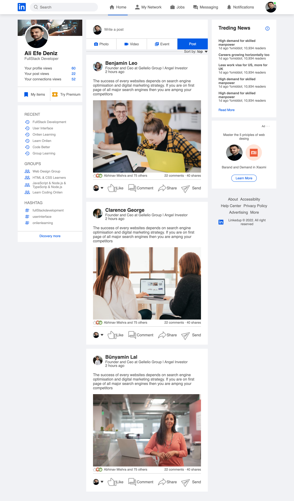

# 📸 Linkedin Clone

This project is a responsive clone of Linkedin's web interface, developed using **HTML5**, **CSS3**. It was created to reinforce frontend development skills and code modern web interface designs.



## 🔗 Live Demo (Optional)

You can view the live version of the project here: [https://github.com/Efe-Deniz/Linkedin-Clone]

---

## 🛠️ Technologies Used

The following technologies and tools were used in this project:

-   **HTML5:** Semantic tag structure.
-   **CSS3:** Customized styles and detailed designs.

---

## ✨ Features

This clone project includes the following sections:

-   **Navbar:** Logo, search bar, and navigation icons.
-   **Stories Section:** Horizontally scrollable user stories area.
-   **Feed:** Post title, image, interaction buttons (like, comment), like count, and descriptions.
-   **Sidebar:** User profile, suggested accounts, and footer links.
-   **Responsive Design:** Fully compatible with mobile, tablet, and desktop devices.

---

## 📂 File Structure

instagram-clone/
├── image
├──style.css
├── index.html
└── README.md

📌 Upcoming Updates (To-Do)
[ ] Enabling the like button with JavaScript.

[ ] Adding a click animation to the Stories section.

👨‍💻 Author
[Ali Efe Deniz]

GitHub: https://github.com/Efe-Deniz

```

```
